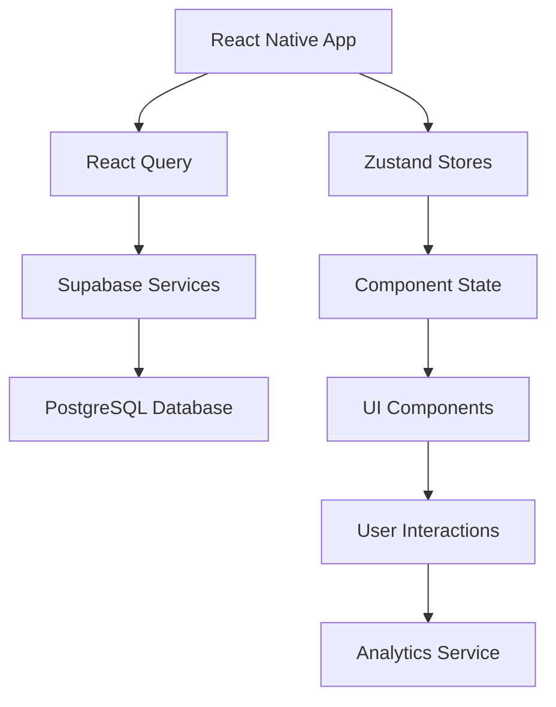
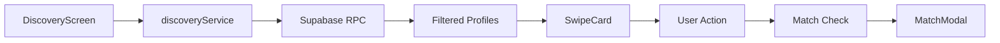
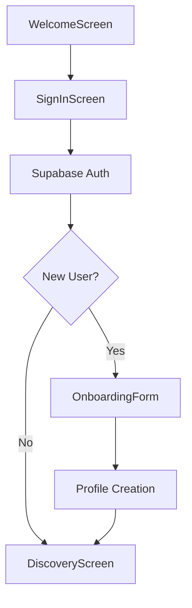

# 📘 KINEVO Project Overview

## 🧠 Project Purpose

KINEVO is a bilingual (English/French) mobile application designed to help sports enthusiasts discover and challenge nearby partners based on shared preferences and proximity. The app connects users through location-based matching, allowing them to find compatible sports partners, join events, and book courts for competitive play. Built with React Native and Expo, KINEVO provides a seamless cross-platform experience for building local sports communities.

## 🏗️ App Architecture

| Technology | Purpose | Implementation |
|------------|---------|----------------|
| **Frontend** | React Native (Expo) | Cross-platform mobile development with Expo SDK 53 |
| **Backend** | Supabase | PostgreSQL database with real-time subscriptions and authentication |
| **State Management** | Zustand | Lightweight state management for user, discovery, and onboarding stores |
| **Server State** | React Query (@tanstack/react-query) | Data fetching, caching, and synchronization |
| **Navigation** | React Navigation v7 | Stack and bottom tab navigation with TypeScript support |
| **Internationalization** | Custom i18n service | Bilingual support with English and French translations |
| **Analytics** | Custom analytics service | Integrated event tracking via `logEvent(...)` system |
| **Styling** | Custom theme system | Centralized colors, typography, spacing, and gradients |

## 📁 Folder Structure Description

| Folder | Purpose | Development Rules |
|--------|---------|-------------------|
| `src/components/` | Atomic design component library | **Atoms** (Button, Input), **Molecules** (FilterSlider), **Organisms** (SwipeCard), **Business** (feature-specific components). All components must be theme-aware, accessible, and include analytics logging. |
| `src/features/` | Feature-based modules | Each feature (auth, discovery, matchzone, events, chat, profile) contains screens, components, services, and stores. Keep feature-specific logic isolated. |
| `src/shared/hooks/` | Reusable React hooks | Custom hooks for common functionality across features. Must be pure and reusable. |
| `src/shared/services/` | API and business logic | Service layer for Supabase integration, authentication, and data management. Keep API logic separate from UI components. |
| `src/shared/stores/` | Global Zustand stores | User store, discovery store, and other global state. Use TypeScript interfaces and maintain immutability. |
| `src/theme/` | Design system | Colors, typography, spacing, gradients. All components must use theme values instead of hardcoded styles. |
| `src/navigation/` | Navigation configuration | Stack and tab navigators with proper TypeScript param lists. Keep navigation logic centralized. |
| `src/config/` | App configuration | Supabase client, environment variables, and app constants. |
| `types/` | TypeScript definitions | Database types, navigation params, and shared interfaces. |
| `assets/illustrations/` | Illustration assets | SVG and image assets for onboarding and empty states. |
| `assets/icons/` | Icon assets | Vector icons and app icons. Use react-native-vector-icons when possible. |

## 🧩 Component System

KINEVO follows **Atomic Design** principles with four component layers:

### Atoms
Basic building blocks that cannot be broken down further:
- `Button` - Multiple variants (primary, secondary, outline) with analytics integration
- `InputField` - Text inputs with validation and theming
- `Typography` - Text components with consistent styling
- `Avatar` - User profile images with fallbacks
- `Tag` - Selectable chips for sports and preferences

### Molecules
Combinations of atoms that form functional units:
- `FilterSlider` - Distance and age range sliders
- `ImageCarousel` - Profile photo galleries
- `FiltersChipGroup` - Applied filter display
- `PhotoSelector` - Image upload and management

### Organisms
Complex components that combine molecules and atoms:
- `SwipeCard` - Profile discovery cards with image carousel and user info
- `BottomNavBar` - Main navigation with badge support
- `FilterModal` - Complete filtering interface
- `MatchModal` - Match confirmation and chat initiation

### Business Components
Feature-specific components that combine organisms for complete functionality:
- `RevertButton` - Discovery screen action button
- `ChallengeButton` - Profile interaction button
- `NotificationButton` - Header notification access

**Component Requirements:**
- ✅ **Reusability** - Components must work across different contexts
- ✅ **Accessibility** - Include testIDs and accessibility labels
- ✅ **Analytics** - Log user interactions with `logEvent()`
- ✅ **Theme-awareness** - Use theme values for colors, spacing, and typography

## 📦 Modules Overview

### 🔐 Auth Module
**Purpose:** User authentication and onboarding flow
- **Screens:** `SignInScreen`, `SignUpScreen`, `OnboardingForm`, `WelcomeScreen`
- **Components:** Social auth buttons, form validation
- **Services:** `authService` for Supabase authentication
- **Stores:** `authStore` for authentication state
- **Key Features:** Mock authentication, bilingual forms, comprehensive validation

### 🔍 Discovery Module
**Purpose:** Location-based profile discovery and matching
- **Screens:** `DiscoveryScreen` with swipe interface
- **Components:** `SwipeCard`, `FilterModal`, `MatchModal`
- **Services:** `discoveryService` for profile fetching and matching
- **Stores:** `discoveryStore`, `useDiscoverFiltersStore`
- **Key Features:** GPS-based filtering, mutual compatibility matching, analytics tracking

### 🏟️ Matchzone Module
**Purpose:** Competitive arena and court booking
- **Screens:** Arena view with court availability
- **Components:** Court cards, booking interface
- **Services:** Court booking and availability
- **Key Features:** Real-time court status, booking management

### 📅 Events Module
**Purpose:** Sports event discovery and participation
- **Screens:** Event listings and details
- **Components:** Event cards, RSVP interface
- **Services:** Event management and participation
- **Key Features:** Event creation, joining, and social sharing

### 💬 Chat Module
**Purpose:** Real-time messaging between matched users
- **Screens:** Chat list and conversation views
- **Components:** Message bubbles, input interface
- **Services:** Real-time messaging via Supabase
- **Key Features:** Match-based conversations, real-time updates

### 👤 Profile Module
**Purpose:** User profile management and editing
- **Screens:** Profile view and edit screens
- **Components:** Photo management, preference settings
- **Services:** Profile updates and photo uploads
- **Stores:** `userStore` for profile data
- **Key Features:** Multi-photo uploads, sports preferences, availability settings

## 🌍 Bilingual & Localization System

KINEVO supports **English** and **French** through a custom i18n system:

### Implementation Rules
- ✅ **All UI text** must use `t('translation.key')` function
- ✅ **Translation keys** follow dot notation: `'auth.signIn'`, `'discovery.noMoreProfiles'`
- ✅ **Fallback behavior** returns the key if translation is missing
- ✅ **Device language detection** automatically sets language on app launch

### Translation Storage
```typescript
// Located in src/shared/utils/i18n.ts
export const translations: Translations = {
  'auth.signIn': {
    en: 'Sign In',
    fr: 'Se connecter',
  },
  'discovery.challenge': {
    en: 'Challenge',
    fr: 'Défier',
  }
};
```

### Usage Example
```typescript
import { t } from '@/shared/utils/i18n';

// In components
<Button title={t('common.save')} />
<Text>{t('profile.age', 'years')}</Text> // With fallback
```

## 📊 Analytics System

KINEVO includes comprehensive analytics tracking through a custom service:

### Implementation
```typescript
import { logEvent, Events } from '@/shared/utils/analytics';

// Track user interactions
logEvent(Events.BUTTON_PRESSED, { 
  buttonType: 'challenge',
  userId: user.id,
  targetUserId: profile.id 
});
```

### Common Tracked Events
- **Authentication:** `LOGIN_SUCCESS`, `SIGNUP_COMPLETED`, `LOGOUT`
- **Discovery:** `PROFILE_SWIPED_RIGHT`, `PROFILE_SWIPED_LEFT`, `MATCH_CREATED`
- **Profile:** `PROFILE_VIEWED`, `PROFILE_EDITED`, `PHOTO_UPLOADED`
- **Navigation:** `SCREEN_VIEWED`, `TAB_SWITCHED`
- **Interactions:** `BUTTON_PRESSED`, `MODAL_OPENED`, `FILTER_APPLIED`

### Analytics Requirements
- ✅ **Button interactions** must log `BUTTON_PRESSED` with context
- ✅ **Screen views** must log `SCREEN_VIEWED` with screen name
- ✅ **Important actions** (swipes, matches, bookings) must be tracked
- ✅ **Modal interactions** must log open/close events
- ✅ **User properties** should be set on authentication

## 🧠 Instructions for AI Coding Agents

### Development Guidelines
1. **Type Safety First**
   - Always use existing TypeScript interfaces from `src/shared/types/`
   - Import database types from `src/shared/types/database.ts`
   - Maintain strict type checking throughout

2. **Component Architecture**
   - Use atomic design principles - place components in correct folders
   - Prefer reusable components over feature-specific ones
   - Feature-specific components go in `src/features/<feature>/components/`

3. **State Management**
   - Store API logic in `src/shared/services/` directory
   - Use Zustand stores for global state management
   - Keep component state local when possible

4. **Styling & Theming**
   - Always use theme values: `theme.colors.primary`, `theme.spacing.md`
   - Never hardcode colors, spacing, or typography
   - Maintain consistent spacing using theme system

5. **Internationalization**
   - All user-facing text must use `t('translation.key')`
   - Add new translation keys to `src/shared/utils/i18n.ts`
   - Provide both English and French translations

6. **Analytics Integration**
   - Add `logEvent()` calls for all user interactions
   - Use existing event constants from `Events` object
   - Include relevant context in event properties

7. **Database Integration**
   - Use Supabase client from `src/config/supabase.ts`
   - Follow Row Level Security (RLS) patterns
   - Handle authentication state properly

### Code Quality Standards
- ✅ **Error Handling:** Always include try/catch blocks for async operations
- ✅ **Loading States:** Show loading indicators during async operations  
- ✅ **Accessibility:** Include testIDs and accessibility labels
- ✅ **Performance:** Use React.memo and useMemo for expensive operations
- ✅ **Testing:** Write unit tests for utility functions and services

## 📌 Current Focus and Roadmap

<details>
<summary>📌 Current Roadmap</summary>

### ✅ Completed Features
- [x] Implement DiscoveryService.ts with location-based filtering ✅
- [x] Integrate SwipeCard with backend matching ✅
- [x] Build comprehensive SignInScreen with mock authentication ✅
- [x] Create OnboardingForm with profile data collection ✅
- [x] Implement FilterSlider components (distance, age range) ✅
- [x] Fix Expo Go compatibility issues ✅
- [x] Integrate Supabase backend configuration ✅
- [x] Resolve database schema inconsistencies ✅

### 🚧 In Progress
- [ ] Finalize Auth onboarding UI flow
- [ ] Implement real-time chat functionality
- [ ] Build Event creation and management system

### 📋 Upcoming Features
- [ ] Build full Event & Court Card System
- [ ] Implement push notifications with Expo Notifications
- [ ] Add photo upload and storage integration
- [ ] Create coach discovery and booking system
- [ ] Implement in-app court booking
- [ ] Add social sharing capabilities
- [ ] Build comprehensive user settings

### 🐛 Known Issues
- [ ] Sports preferences moved to filter_preferences table - update related components
- [ ] Optimize RPC functions for better performance
- [ ] Add proper error boundaries for better crash handling

</details>

## 🗺️ Data Flow Diagrams

### Architecture Overview


### Discovery Flow


### Authentication Flow


---

**Last Updated:** January 2025  
**Version:** 1.0.0  
**Maintainers:** Momentum Development Team

> 💡 **Note for AI Agents:** This document serves as the single source of truth for the Momentum project architecture. Always refer to this guide when making development decisions and update it when significant changes are made to the codebase.
